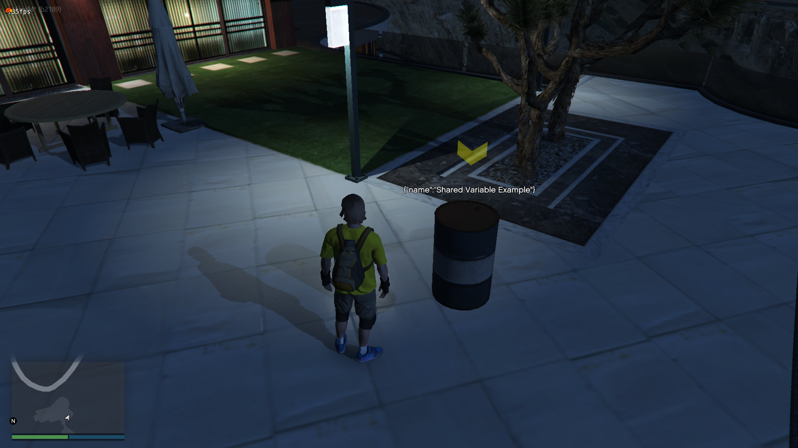
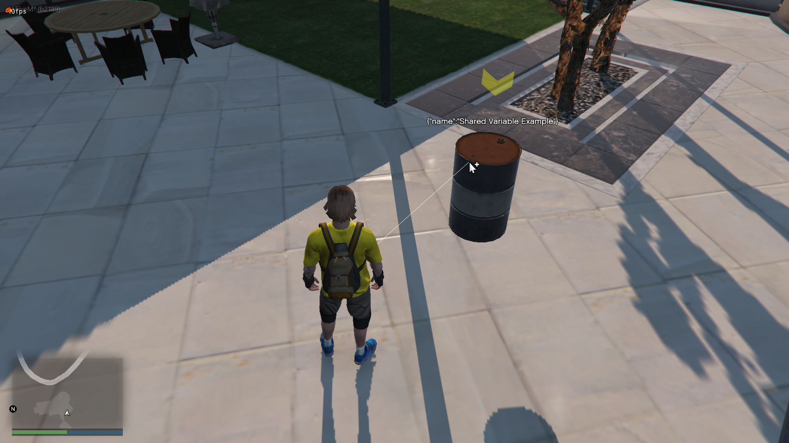

# ObjectController



- [ObjectController](#objectcontroller)
  - [I have a question. (DISCORD)](#i-have-a-question-discord)
  - [About](#about)
  - [Features](#features)
  - [Whats the point of this resource?](#whats-the-point-of-this-resource)
  - [Usage](#usage)
    - [Spawning object](#spawning-object)
    - [Setting & Getting variables (shared & server)](#setting--getting-variables-shared--server)
    - [Variable triggered events.](#variable-triggered-events)
      - [Serverside](#serverside)
      - [Clientside](#clientside)
    - [Export functions](#export-functions)
      - [Serverside](#serverside-1)
      - [Clientside](#clientside-1)
    - [Adding render & deleting functions (function pool)](#adding-render--deleting-functions-function-pool)
      - [Whats this?](#whats-this)
      - [Adding functions & examples](#adding-functions--examples)
  - [Functions under the **object class**](#functions-under-the-object-class)
  - [Aiming](#aiming)

## [I have a question. (DISCORD)](https://discord.gg/FBKuqSfdQD)

## About

Serverside **'static'** object creator for FiveM.
<br>
You can easily create objects on serverstart with synced variables and other helping functions.

Keep in mind these objects are **not networked** on clientside, so if you are triggering a clientside function on them it will not be synced to other clients.

## Features

- Add variables to objects (shared or only server variable)
- Click on objects with raycasting. (turnoff available in config.lua)
- Config and **'globally'** triggered events already added. (Object clicking, variable change, etc.) [**GO TO CONFIG**](config.lua)

## Whats the point of this resource?
If you are planning to make a job/hobby where you need to create static objects and set variables on them then this resource will make your day easier.

**Example:**
<br>
You want to create a wine job with spawned barrel objects.
> In some way you will want the player to have action with the barrels, for example lets assume that the player have apples in his inventory, he can put these apples inside the barrel, so when the object clicked you open some kind of menu then the actions will be showed, the player puts in the apples inside the barrel, you easily set the variables on serverside.
>> Now this barrel have a globally set **safe** variable on serverside.

## Usage
### Spawning object
```lua
--> ObjectController.create = function(_model, _position, _uid, _options)
-- _options = {
--     rotation = vector3,
--     freezed = boolean,
--     collision = boolean,
--     alpha = number,
--     clickable = boolean,
--     servervars = table,
--     sharedvars = table,
-- }

-- @return {
--     uid = self.data.uid,
--     object = ObjectController._store[self.data.uid]
-- }

local o = ObjectController.create('prop_barrel_01a', vector3(-2612, 1870, 167), 'uid-1', {
    clickable = true
})
-- print(o.uid) - @string
-- print(o.object) - @table
```
### Setting & Getting variables (shared & server)
```lua
local o = ObjectController.create('prop_barrel_01a', vector3(-2612, 1870, 167), 'uid-1', {
    clickable = true
})
o.object.setSharedVar('name', 'Shared Variable Example')
o.object.setSharedVar('progress', 5)
o.object.setServerVariable('safe_key', '49fasj384823492898')

-- Getting variables
local name = o.object.getSharedVar('name')
print(name) -- @returns 'Shared Variable Example'
print(o.object.getServerVar('safe_key')) -- @returns '49fasj384823492898'
```

### Variable triggered events.
#### Serverside

```lua
RegisterNetEvent(Config.Events.object_clicked)
RegisterNetEvent(Config.Events.variable_changed)

AddEventHandler(Config.Events.object_clicked, function(uid, data)
    -- print(uid, data)
end)

AddEventHandler(Config.Events.variable_changed, function(uid, key, value)
    -- Config.DebugMsg(string.format('Object variable changed: (%s) %s', key, value))
end)
```
#### Clientside

```lua
RegisterNetEvent(Config.Events.object_clicked)
RegisterNetEvent(Config.Events.variable_changed)

AddEventHandler(Config.Events.object_clicked, function(uid, data)
    -- print(uid, data)
end)

AddEventHandler(Config.Events.variable_changed, function(uid, key, value)
    -- Config.DebugMsg(string.format('Object variable changed: (%s) %s', key, value))
end)
```

### Export functions
#### Serverside
```lua
exports('oc_create', ObjectController.create)
exports('oc_delete', ObjectController.delete)
exports('oc_get', ObjectController.get)
exports('oc_exist', ObjectController.exist)
```
#### Clientside
```lua
exports('oc_addfunction', FunctionController.add)
exports('oc_removefunction', FunctionController.remove)
```

### Adding render & deleting functions (function pool)
#### Whats this?
We have a custom thread which triggers every function which is added to this pool.
<br>
With this, you do not need to always create a for loop with the streamed objects.
#### Adding functions & examples

If you create a function with the same **uid** then you will receive a console message on clientside and the function **remains the old one.**

```lua
-- FunctionController.add = function(uid, func)

-- Render out variables
FunctionController.add('render-names', function(data) -- <-- data always gets called
    DrawText3D(data.position.x, data.position.y, data.position.z + 1.2, json.encode(data.sharedvars))
end)

-- Add one more render function (eg. markers)
FunctionController.add('render-markers', function(data) -- <-- data always gets called
    local x, y, z = table.unpack(data.position)
    DrawMarker(2, x, y, z + 1.5, 0.0, 0.0, 0.0, 0.0, 180.0, 0.0, 0.25, 0.25, 0.25, 255, 255, 0, 50, false, true, 2, nil,
        nil, false)
end)

-- Delete render function with timeout
Citizen.CreateThread(function()
    Citizen.Wait(5000)
    FunctionController.remove('render-names')
end)
```

## Functions under the **object class**
```
+ setPosition(_pos: vector3)
+ setRotation(_rot: vector3)
+ setFreezed(_state: boolean) -- (Freeze object)
+ setModel(_model: string) -- (Change object model)
+ setAlpha(_alpha: number) -- (Set object alpha)
+ setServerVariable(key: string, value: any)
+ getServerVar(key: string)
+ setSharedVar(key: string, value: any)
+ getSharedVar(key: string)
+ save (You need to setup it with database etc, the examples are already inside the **server.lua** file)
```
## Aiming
